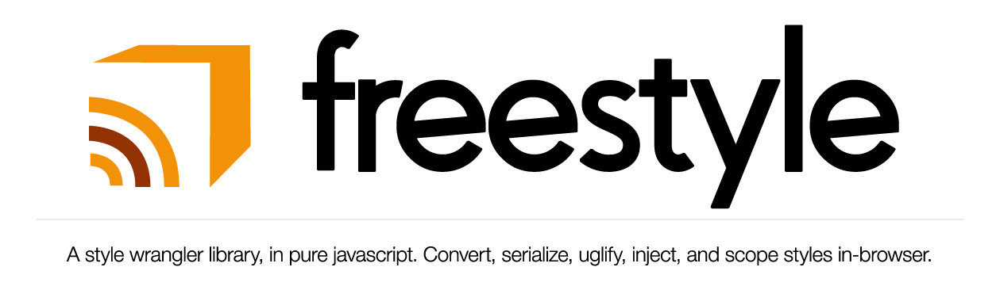

##### Installation
```bash
bower install freestyle --save
```

# API
> **This API Documentation is only *partially* complete. Check the source of `freestyle.js` for a complete view of the methods avaialble.**

The following CSS styles will be used for all relevant examples.
```js
let exampleCSS = `
  button, .imitation-button {
    background-color: #333;
    color: #fff;
    padding: 10px 30px;
    border: 1px solid #666;
  }
  
  article {
    display: inline-block;
  }
  
  h1.myClass, h2 {
    color: #8c42eb;
    margin: 20px auto;
  }
`;
```

## Utilities / Internals

#### `.explode(text, splitBy)`
Splits a string given as `text` by the character `splitBy`, then trims whitespace from each, and filters empty strings. Used internally for general parsing.

```js
let exampleStr = `LO!, and behold, , space , upon ,   space. ,,,,,,`;

freestyle.explode(exampleStr, ',');
// ...
[
  'LO!',
  'and behold',
  'space',
  'upon',
  'space.'
];
```

#### `.camelToKebabCase(str)`
Turns a camelCase string to kebab-case. Used internally to transform css property names.
```js
let myCamelVar = 'loAndBeholdACamelString';

freestyle.camelToKebabCase(myCamelVar);
// ...
'lo-and-behold-a-camel-string'
```


#### `.kebabToCamelCase(str)`
Like `camelToKebabCase`, but the other way around. Used internally to transform css property names.
```js
let myKebabVar = 'lo-and-behold-a-kebab-string';

freestyle.kebabToCamelCase(myKebabVar);
// ...
'loAndBeholdAKebabString'
```

#### `.isValidCss(css)`
Checks a string given by `css`. Returns `true` if deemed valid, `false` if not.


CSS is deemed valid when the following conditions are satisfied:
- Input is a non-empty string.
- Both types of curly brackets (`{` and `}`) are present in the input.
- The number of left-side curly brackets (`{`) exactly matches the number of right-side curly brackets (`}`).
- The number of left-side comment indicators (`/*`) exactly matches the number of right-side comment indicators (`*/`).

```js
let weirdness = `h1 { color: orange`;
let strange = `/* AHAHAHAHA */ body { border: none } /* AHAAAA`;
let normality = `h1 { color: orange; }`;

freestyle.isValidCss(weirdness); // false
freestyle.isValidCss(strange); // false
freestyle.isValidCss(normality); // true
```

## Conversions

### `.cssToStyleList(css)`
Converts a CSS string to a *styleList*. A styleList is an array of objects each representing a CSS ruleset and containing the following properties:
- `selectors`, an array of the CSS selectors in the ruleset.
- `rules`, a plain object representing the rules of the ruleset.

```js
let styleList = freestyle.cssToStyleList(someStyles));
// ...
[
   {
     "selectors": [ "button", ".imitation-button" ],
     "rules": {
       "background-color": "#333",
       "color": "#fff",
       "padding": "10px 30px",
       "border": "1px solid #666"
     }
   },
   {
     "selectors": [ "article" ],
     "rules": {
       "display": "inline-block"
     }
   },
   {
     "selectors": [ "h1.myClass", "h2" ],
     "rules": {
       "color": "#8c42eb",
       "margin": "20px auto"
     }
   }
 ]
```

#### `.cssToPlainObject(css, multipleSelectorsPerKey)`
Returns a plain javascript object representation of `css`, optionally allowing keys to contain multiple selectors when `multipleSelectorsPerKey` is `true`.

Always converts kebab-case-property-names into camelCase equivalents for all your jQuery and modern UI needs.

```js
{ 
  body: { 
    backgroundColor: 'rgb(45, 45, 46)',
    color: 'rgb(135, 195, 247)',
    boxShadow: 'inset 0px 0px 40px rgba(0, 0, 0, 0.5)'
  },
  'h1.myClass': {
    color: '#8c42eb',
    margin: '20px auto'
  },
  h2: {
    color: '#8c42eb',
    margin: '20px auto'
  }
}
```